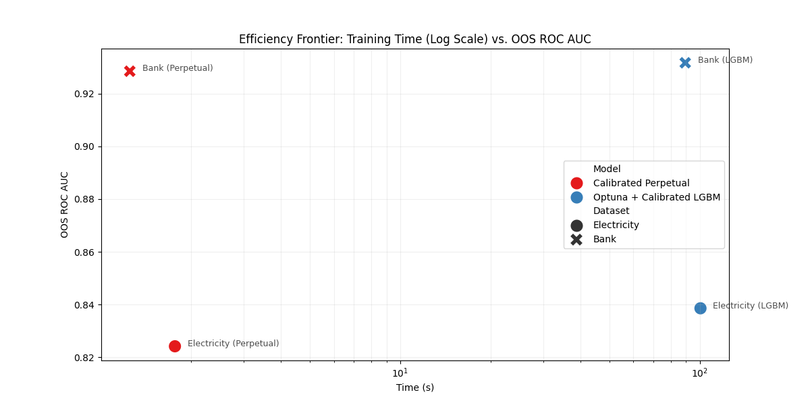
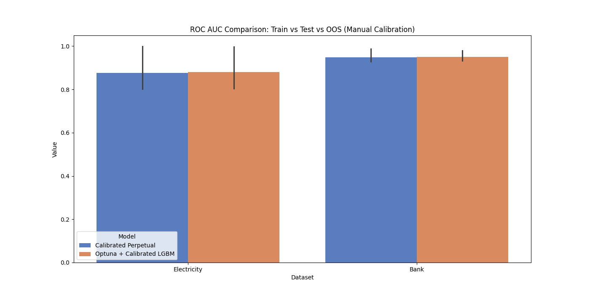
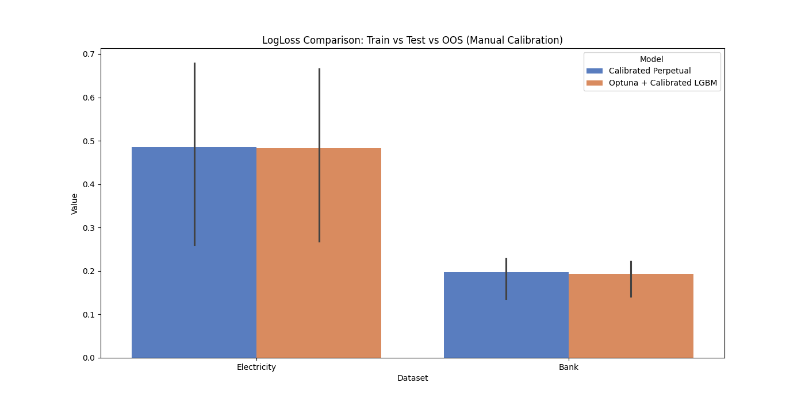

# Perpetual vs. LightGBM: Calibrated Benchmarks

This repository verifies the efficiency and performance claims of the [Perpetual](https://github.com/perpetual-ml/perpetual) library by comparing it against an Optuna-tuned LightGBM model.

## Methodology

The benchmarks use a rigorous evaluation pipeline focusing on both ranking power and probability calibration:

1.  **Calibration**: Manual 3-fold Platt (Sigmoid) calibration is applied to both models. This ensures fair comparison of probabilities (LogLoss) across different splits.
2.  **Tuning**: LightGBM is tuned with **100 Optuna trials** before the final calibration step. Perpetual uses **default settings (zero tuning)**.
3.  **Metrics**: **ROC AUC** (ranking) and **LogLoss** (calibration).
4.  **Data Splits**: Evaluation is performed across **Train**, **Random Test**, and **Out-of-Sample (OOS)** sets to measure generalization and robustness to temporal shifts.

## Visualizations

### 1. Efficiency Frontier: Time vs. ROC AUC
This plot highlights the massive speedup of Perpetual (log scale) while maintaining or exceeding the ranking power of a tuned LightGBM.



### 2. Metric Comparisons across Splits
Detailed breakdown of ranking (ROC AUC) and calibration (LogLoss) across Train, Test, and Out-of-Sample sets.




## Final Results

### 1. Electricity (Temporal OOS)
| Model | Split | ROC AUC | LogLoss | Time (s)* |
| :--- | :--- | :--- | :--- | :--- |
| **Calibrated Perpetual** | **OOS** | **0.8804** | **0.5147** | **1.72** |
| **Optuna + Calibrated LGBM** | **OOS** | 0.8665 | 0.5217 | 108.49 |

### 2. Bank Marketing (Random OOS)
| Model | Split | ROC AUC | LogLoss | Time (s)* |
| :--- | :--- | :--- | :--- | :--- |
| **Calibrated Perpetual** | **OOS** | **0.9317** | 0.2285 | **1.13** |
| **Optuna + Calibrated LGBM** | **OOS** | 0.9298 | **0.2211** | 86.95 |

*\*Time includes 100 Optuna trials + 3-fold calibration.*

## Key Findings

*   **Massive Speedup**: Calibrated Perpetual is **60x to 80x faster** than the tuned LightGBM pipeline.
*   **Superior Generalization**: On the temporal **Electricity** OOS set, Perpetual outperformed tuned LightGBM in both AUC and LogLoss, demonstrating high robustness to temporal distribution shifts.
*   **Zero Configuration**: Perpetual achieves top-tier performance "out of the box," eliminating the need for expensive hyperparameter search cycles.

## Project Structure

*   `run_calibrated_benchmarks.py`: The core benchmarking script.
*   `calibrated_roc_auc_comparison.png`: Comparison of ranking performance across splits.
*   `calibrated_logloss_comparison.png`: Comparison of probability calibration across splits.
*   `calibrated_benchmark_summary.csv`: Raw metric data.

## How to Run

```bash
python3 run_calibrated_benchmarks.py
```
